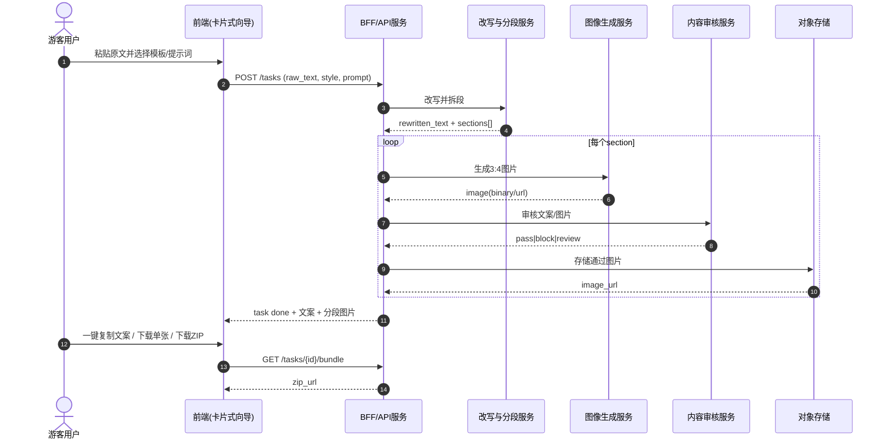

# PRD - 小红书文生图网站（MVP）

## 1. 核心目标 (Mission)
让任何用户把长文章一键转成小红书可发布的分段文案与每段配图，并可直接复制文案和下载图片发布。

## 2. 用户画像 (Persona)
- 泛人群创作者（学生、博主、商家、职场人）
- 核心痛点：
  - 不会把长文改写成小红书风格
  - 不知道如何分段更易读
  - 每段配图制作成本高、速度慢
  - 发布前整理文案和素材麻烦

## 3. 版本规划

### V1: 最小可行产品 (MVP)
- 输入原始文章（粘贴文本）
- AI 改写为小红书风格文案
- 自动按舒适阅读拆分为多段
- 为每一段自动生成 1 张 3:4 配图
- 提供预设模板 + 自由提示词双模式
- 结果页支持整篇文案一键复制
- 结果页支持全部图片打包下载/逐张下载
- 游客可用（无需登录）
- 基础内容安全（文本审核 + 图片审核）
- 失败重试与清晰错误提示

### V2 及以后版本 (Future Releases)
- 登录与账号体系（云端历史）
- 次数/积分/订阅计费
- 多尺寸输出（1:1、9:16）
- 一键生成封面 + 标题 + 标签建议
- 品牌风格库（固定配色/视觉调性）
- 批量任务与队列优先级
- 数据看板（成功率、耗时、留存）

## 4. 关键业务逻辑 (Business Rules)
- 游客单设备/单 IP 限频，防滥用
- 流程固定：原文输入 -> 改写 -> 分段 -> 分段配图 -> 审核 -> 结果输出
- 每段默认生成 1 张图，比例固定 3:4
- 模板模式优先注入预设风格词；自由模式追加用户提示词
- 任一段图片失败时，仅重试失败段，不重跑全任务
- 审核未通过时返回原因类型并给出可修改建议
- 下载支持“全部打包”与“单张下载”，文案支持“一键复制”

## 5. 数据契约 (Data Contract)

### RewriteRequest
```json
{
  "raw_text": "string",
  "tone_template_id": "string|null",
  "free_prompt": "string|null"
}
```

### RewriteResult
```json
{
  "rewritten_text": "string",
  "sections": [
    {
      "section_id": "string",
      "section_text": "string",
      "order": 1
    }
  ]
}
```

### ImageGenerateRequest
```json
{
  "task_id": "string",
  "section_id": "string",
  "section_text": "string",
  "style_template_id": "string|null",
  "free_prompt": "string|null",
  "ratio": "3:4"
}
```

### ImageGenerateResult
```json
{
  "section_id": "string",
  "image_url": "string",
  "audit_status": "pass|block|review",
  "error_code": "string|null"
}
```

### PublishBundle
```json
{
  "final_caption_text": "string",
  "images": ["string"],
  "download_zip_url": "string|null"
}
```

## 6. MVP 原型（已确认：卡片式方案 C）

```text
+----------------------------------------------------------------------------------+
| LOGO                         3步完成小红书图文发布                                |
+----------------------------------------------------------------------------------+

[卡片1] 上传原文
+--------------------------------------------------------------+
| 粘贴你的长文章                                                |
| [..........................................................] |
| [..........................................................] |
| [下一步：AI改写]                                              |
+--------------------------------------------------------------+

[卡片2] 选择风格与规则
+--------------------------------------------------------------+
| 改写语气: [轻松种草 v]                                        |
| 配图方式: (o)预设模板   ( )自由提示词                         |
| 模板: [美食探店 v]                                             |
| 自由提示词: [可选..........................................] |
| 图片比例: 3:4（固定）                                         |
| [上一步]                                   [开始生成]         |
+--------------------------------------------------------------+

[卡片3] 生成结果
+--------------------------------------------------------------+
| 整篇文案（已按舒适阅读拆段）                                 |
| 段1: ......   [复制段落]                                      |
| 段2: ......   [复制段落]                                      |
| 段3: ......   [复制段落]                                      |
|--------------------------------------------------------------|
| [段1图] [下载]   [段2图] [下载]   [段3图] [下载]             |
| 审核: 全部通过                                                 |
| [一键复制全文]                         [下载全部图片ZIP]      |
+--------------------------------------------------------------+
```

### 原型设计说明
- 采用三卡片向导式交互，降低首次使用门槛
- 核心操作集中在“下一步/开始生成/复制/下载”四类动作
- 将复杂配置折叠到第二卡，避免首页认知负担
- 结果页以“文案段落 + 对应配图”一一映射，便于直接发布

## 7. 架构设计蓝图

### 核心流程图（Mermaid）


### 组件交互说明
- 新增前端模块：
  - `CardWizard`：三步向导容器，控制步骤流转
  - `InputCard`：原文输入与校验
  - `ConfigCard`：模板/自由提示词配置
  - `ResultCard`：分段文案、配图列表、复制与下载
  - `TaskProgress`：异步任务状态展示（pending/running/done/failed）
- 新增后端模块：
  - `TaskController`：任务创建、查询、重试、打包下载
  - `RewriteService`：调用第三方 LLM 做改写与分段
  - `ImageService`：按段调用第三方文生图 API（固定 3:4）
  - `ModerationService`：文案与图像审核
  - `BundleService`：生成 ZIP 下载链接
  - `RateLimitMiddleware`：游客限频
- 调用关系：
  - 前端仅调用 `TaskController` 暴露的 API
  - `TaskController` 编排 `RewriteService -> ImageService -> ModerationService -> BundleService`
  - 各服务通过 `TaskRepository` 落地状态，前端轮询或 SSE 拉取进度

### 技术选型与风险
- 关键选型：
  - 前端：Next.js + Tailwind（卡片向导实现成本低、响应式快）
  - 后端：Node.js/NestJS 或 Next.js API Route（MVP 优先开发效率）
  - 异步任务：BullMQ + Redis（应对多段图片并发）
  - 存储：S3 兼容对象存储（图片与ZIP）
  - 第三方能力：LLM 改写、文生图、审核 API
- 潜在风险与缓解：
  - 第三方 API 不稳定：增加重试、熔断、降级文案
  - 多段生成耗时过长：并发上限 + 进度可视化 + 失败段局部重试
  - 审核误杀或漏审：双层策略（供应商审核 + 关键词规则）
  - 游客滥用导致成本失控：IP/设备限频 + 验证码阈值
  - ZIP 打包大文件超时：异步打包并缓存短期下载链接

## 8. 里程碑建议（MVP）
- M1（第1周）：卡片式前端骨架 + 任务状态流转
- M2（第2周）：改写/分段 + 图片生成打通
- M3（第3周）：审核、下载、重试、限频
- M4（第4周）：灰度发布与监控

## 9. MVP 验收标准
- 用户从粘贴原文到获得可发布结果 <= 90 秒（P50）
- 端到端生成成功率 >= 85%
- 复制文案和下载图片流程可用率 >= 99%
- 审核拦截结果可解释（给出阻断原因类型）
